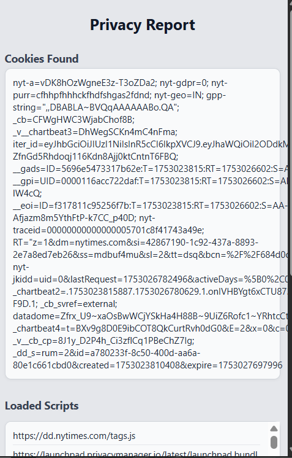
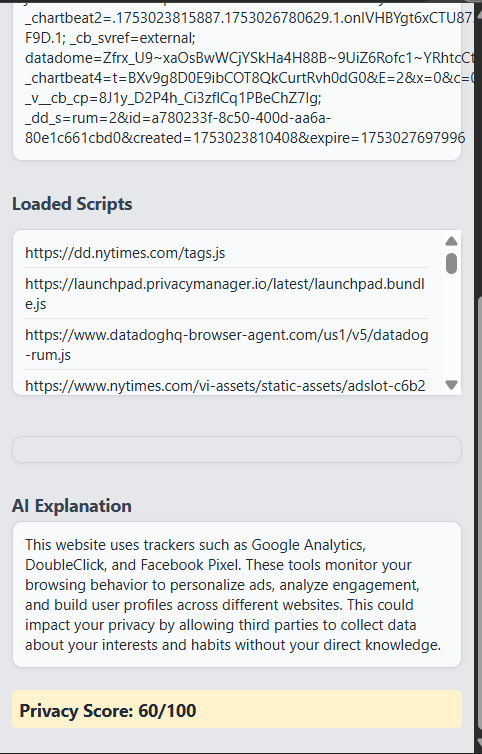

# 🔐 Data Privacy Analyzer – Chrome Extension

A smart Chrome extension that analyzes any website you visit and reports:

✅ All cookies set  
✅ Scripts loaded from third parties  
✅ Known trackers (Google Analytics, Facebook Pixel, etc.)  
✅ A calculated Privacy Score (0–100)  
✅ Optional: AI-generated privacy risk explanation

---

## 🧠 Features

- Detects known trackers using a local JSON database
- Color-coded privacy score display
- AI explanation of tracker risks (via OpenAI API or dummy fallback)
- Clean, modern popup UI
- Chrome Manifest V3

---

## 📸 Demo Screenshot

---

## 📦 Installation (Developer Mode)

1. Download this repo as ZIP or clone it
2. Go to `chrome://extensions`
3. Enable **Developer mode** (top right)
4. Click **Load unpacked**
5. Select the project folder

---

## ⚙️ Config

To use OpenAI explanation:
- Open `popup.js`
- Replace `YOUR_API_KEY_HERE` with your OpenAI secret key

If you don’t want to use the API:
- Use the included dummy explanation logic (already included)

---

## 💬 Tech Used

- JavaScript (ES6)
- Chrome Extension APIs
- OpenAI API (optional)
- HTML + CSS

---

## 🙌 Author

Sameer Chaudhary  
[LinkedIn]([https://www.linkedin.com/in/yourprofile](https://www.linkedin.com/in/sameer-chaudhary-5336542a8/))  
